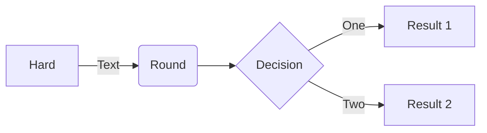
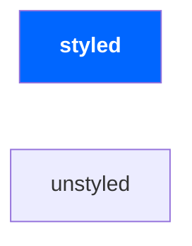

Before I talk about what Mermaid is and why you should use it, let's take a step back and discuss why diagrams are essential for engineers.

## Why Diagram?


Diagrams are an invaluable resource for conveying ideas with clarity and ease. In software engineering, all facets of our work involve the transfer of information over different mediums to make informed decisions. Like slideshows and newsprint, readers tend to be more captivated by images and graphics over long walls of text. In design reviews, diagrams are used to represent complex system architectures and relationships from a birds-eye view. Engineers use these to effectively convey their vision. With large walls of text, readers can be more disengaged, causing them to haphazardly scan through the document. Logic errors, bottlenecks, and security risks that could have been caught in the design phase may one day wreak havoc on production.

Diagrams also play a pivotal role in documentation, where they serve as visual anchors for complex concepts. A boon to engineers old and new, diagrams depict structures that anyone can reference at any time. It fosters better understanding, easier knowledge transfer, and improved operations. The next someone asks you about where your team sits in a vast network of services, you can send them an image that depicts a high-level overview of your upstream and downstream callers.

One of the biggest problems with diagrams, like any other documentation, is that it presents an overhead, sometimes large, to engineers when they don't want to maintain it. The danger comes when engineers forget to update a diagram when changes occur, forget to include a diagram in the first place, or reference a stale diagram as the source of truth. These situations can result in extra engineering time to verify its validity, or worse, making the wrong decisions under incorrect assumptions. If left untouched for even longer, it will have overreaching impacts of slowing the ramp-up of new hires and the productivity of the team.

This is where [Mermaid](https://mermaid.js.org/) comes in, a lightweight diagramming and charting tool designed to tackle stale diagrams.

## What is Mermaid?

Mermaid provides a lightweight syntax akin to Markdown for rendering all sorts of chart types. As of writing, Mermaid supports the following chart types:

**[Flowchart](https://mermaid.js.org/syntax/flowchart.html)**

**[Sequence Diagram](https://mermaid.js.org/syntax/sequenceDiagram.html)**

**[Class Diagram](https://mermaid.js.org/syntax/classDiagram.html)**

**[State Diagram](https://mermaid.js.org/syntax/stateDiagram.html)**

**[Entity Relationship Diagram](https://mermaid.js.org/syntax/entityRelationshipDiagram.html)**

**[User Journey](https://mermaid.js.org/syntax/userJourney.html)**

**[Gantt](https://mermaid.js.org/syntax/gantt.html)**

**[Pie Chart](https://mermaid.js.org/syntax/pie.html)**

**[Quadrant Chart](https://mermaid.js.org/syntax/quadrantChart.html)**

**[Requirement Diagram](https://mermaid.js.org/syntax/requirementDiagram.html)**

**[Gitgraph (Git) Diagram](https://mermaid.js.org/syntax/gitgraph.html)** 

**[C4C Diagram (Context) Diagram](https://mermaid.js.org/syntax/c4c.html)** 

**[Mindmaps](https://mermaid.js.org/syntax/mindmap.html)** 

**[Timeline](https://mermaid.js.org/syntax/timeline.html)** 

**[Zenuml](https://mermaid.js.org/syntax/zenuml.html)**

The list above continues to grow with more functionality added each day. Because it is open-sourced, we can dig into issues and report/fix them ourselves if needed.

Mermaid is designed to make diagramming easier by taking away the cognitive load that comes with positioning boxes, drawing and styling arrows, and other details that don't necessarily make the diagram any clearer -- helping you get things done faster.



Some of the neat features it has include CSS class support and integration from any webpage straight from their CDN.



```html
<script type="module">
  import mermaid from 'https://cdn.jsdelivr.net/npm/mermaid@10/dist/mermaid.esm.min.mjs';
</script>

<pre class="mermaid">
    graph LR
    A --- B
    B-->C[fa:fa-ban forbidden]
    B-->D(fa:fa-spinner);
</pre>
```

## Why Mermaid?

I wouldn't say this is a full-on replacement for heavier graphing applications like LucidChart, but it does solve some of the biggest problems with using these heavier tools. One of the biggest drawbacks of more involved diagramming tools is the amount of busy work that comes with it once you have a rough idea of what parts are needed. This is one reason that would cause people not to diagram in the first place.

Mermaid takes that overhead and tosses it out the window by making all diagrams powered by its JS library and its intuitive syntax. There is no need to export your diagram as an image or some proprietary, editable file format anymore as these diagrams are self-documenting. With the proprietary format, you can edit and view it, but only in an editor that supports that format. With images, anyone can view them, but you cannot edit them. With Mermaid's markup, anyone can easily edit yet understand what the graph is depicting with a simple text editor. 

These diagrams are also immensely portable. They can live in your design docs or your source code. You can audit changes to the diagram via source control to know precisely what things have changed. For complicated visuals, engineers can pinpoint new lines, labels, etc. to make their comprehension faster.

Another reason to try Mermaid for your next diagram is the growing community and third-party integration. With growing support from platforms like Github's Markdown renderer, Google Docs, Jupyter, and more, anyone can easily get started with a diagram by typing a few lines of markup in their favorite SaaS. Today, you can find Mermaid powering Kubernetes's documentation throughout the entire website.


_Mermaid rendering on GitHub._


Last but not least, the tooling is some of the easiest to get started with. Just hop onto [mermaid.live](https://mermaid.live) to try Mermaid out yourself. The editor comes with:

- Syntax highlighting
- Live previews
- Static URLs to share with others
- Export as JPG, PNG, SVG, and more.

If the live editor is not your cup of tea, you can try out their [CLI](https://github.com/mermaid-js/mermaid-cli). With a simple command, you can convert a `.mmd` file to the format you want by specifying a couple of flags. Below is an example of generating an SVG from a Mermaid file with custom CSS:

```sh
mmdc --input test-positive/flowchart1.mmd --cssFile test-positive/flowchart1.css -o docs/animated-flowchart.svg
```

## Closing Thoughts

Mermaid is a simple tool that takes away a lot of the overhead when it comes to creating diagrams. By eliminating the overhead associated with traditional diagramming software, Mermaid allows you to focus on content creation rather than struggling with complex tools. Its lightweight nature, intuitive syntax, and language-agnostic approach make diagramming a seamless and enjoyable experience. Moreover, Mermaid's integration with numerous third-party tools and platforms enhances its versatility and accessibility, allowing you to effortlessly incorporate captivating visualizations into websites, documentation, and other mediums. This is a tool I would gladly recommend the next time you are looking to diagram something.
